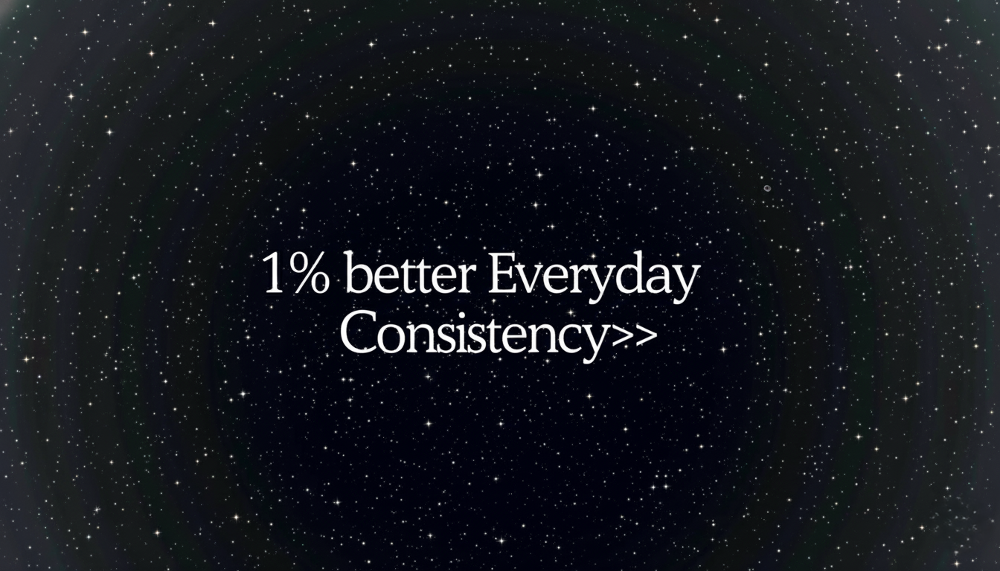

# 👋 Hey, I'm Harshit Vaishnav

🎓 B.Tech CS Student (AI & Data Science)  
🧠 AI & ML Enthusiast | 🛠️ Building useful projects one commit at a time

> **I build things and continuously improve**  
> I'm passionate about creating smart, efficient, secure and clean solutions — from Chat bots to full-stack web projects.

Currently learning AI/ML engineering, refining my DSA skills, and exploring real-world AI applications while expanding my creative thinking.

---

## 🚀 Projects

- • **Intllex**: An AI detection tool that can detect text, images, videos and even news generated by AI
  - ◦ [View Repository](https://github.com/harshit0017pro/Intellex)
  - ◦ [Project Preview](assets/intellex-preview.png)
- • 💼 Portfolio site (in progress)

---

## 💻 Skills & Tech Stack

### Languages

### Tools & Technologies

### Data Science & ML

---

## 💬 Let's Connect

- 🤝 Currently open to learning, hackathons, internships & collabs
- ♟️ Also into chess, editing + visuals

---

## 📚✨ Skill Development ✨📚

 
 

### 🔥 Current Focus Areas

> **Core Python Mastery**  
> Diving deeper into Python fundamentals, advanced concepts, and best practices to build a rock-solid foundation.

> **Data Structures & Algorithms**  
> Strengthening problem-solving abilities and learning to write more efficient, optimized code.

> **LeetCode Practice**  
> Actively solving algorithmic challenges to develop structured thinking and tackle complex problems.

#### 📈 Growth Highlights

- ✅ Improved algorithmic thinking through consistent practice
- ✅ Developed optimization techniques for complex solutions
- ✅ Built structured approach to technical problem-solving
- ✅ Continuous behind-the-scenes learning shaping every project

---

## 🌌 **Galactic Code Statistics** 🌌

---

## ✨ Connect With Me Across The Universe ✨

